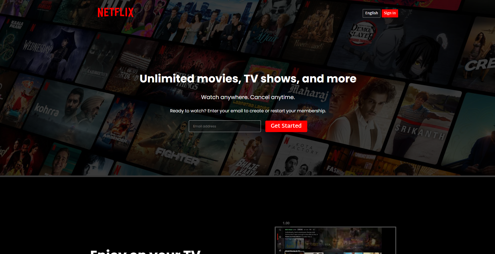

# 📺 Netflix UI Clone

A fully responsive clone of the Netflix homepage built using **HTML** and **CSS**. This project replicates the look and feel of the Netflix landing page, showcasing design precision and front-end layout skills.

## 🌐 Live Demo

👉 [View Live on Netlify](https://home-page-netlfix-clone.netlify.app/)

---

## 🚀 Features

- 🎨 Pixel-perfect UI clone of the Netflix homepage
- 📱 Responsive design for mobile, tablet, and desktop screens
- 💡 Clean and organized HTML5 structure
- 🧩 Modern CSS3 styling with Flexbox and Grid
- 🌑 Dark-themed interface with authentic fonts and icons

---

## 📁 Tech Stack

- **HTML5**
- **CSS3**

---

## 📷 Preview

